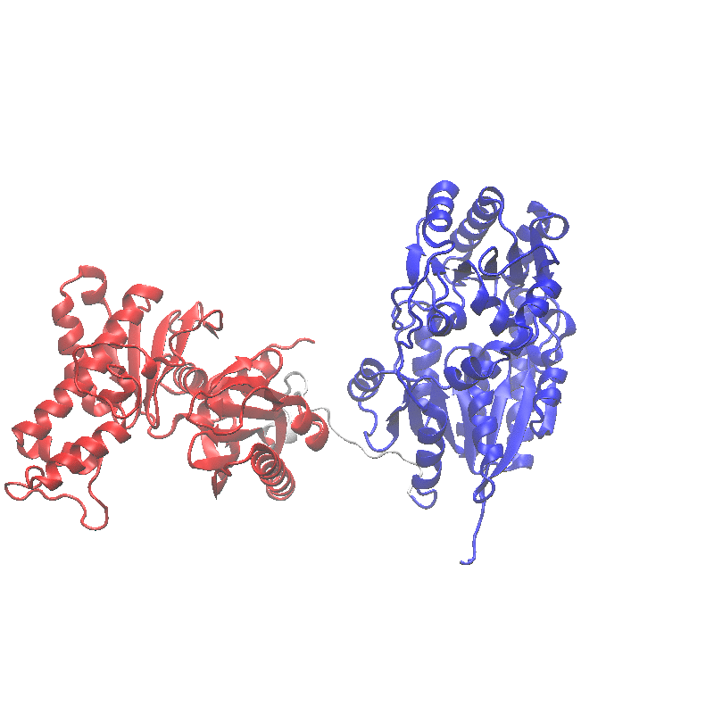
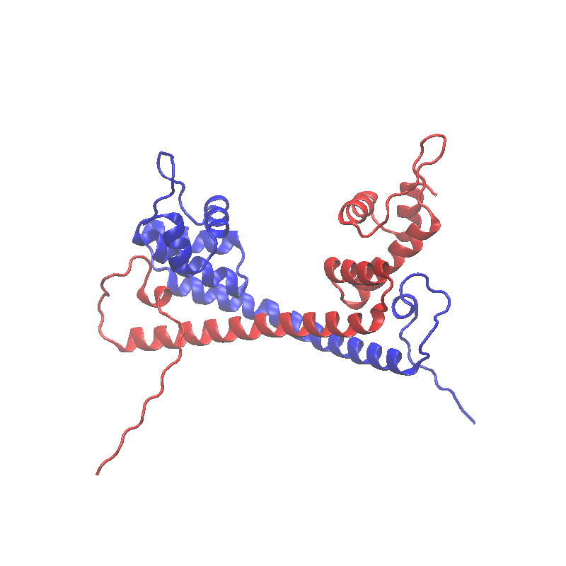

# AF2.Res.Flex

This repository provide proteins obtained from AlphaFold2 (AF2), and the codes used in the manuscript "AlphaFold2 models indicate that protein sequence determines both structure and dynamics" by Guo et al. 

## The AF2 models for 11 proteins include (Table 1; sequences in Appendix):

A: Lanmodulin; 

B: dehalogenase from Deftia acidovorans; 

C: the PAS-A domain protein; 

D: an antifreeze protein (type III) with the X-ray crystallographic structure avalable (PDB ID 1HG7); 

E: a two-domain proten GNE from Homo sapiens (UniProt ID: Q9Y223); 

F: the PAS-A domain containing kinase from Homo sapiens (large protein, the UniProt ID: Q96RG2);

G: the inaZ ice nucleation protein from Pseudomonas syringae (large protein, the UniProt ID P06620); 

H: a heterodimer with the PAS-A domain and the kinase domain; 

I: a homodimer of a MerR-family protein from Mycobacterium tuberculosis (UniProt ID O53384);

J: an intrinsically disordered protein NVJP-1 from Nereis virens; 

K: a randomized protein.

## Python code for un-pickle the data from AF2 models:

plddt.py: get the PLDDT scores for the best AF2 model (highest mean PLDDT)

pae.py: get the PAE matrix for the best AF2 model (highest mean PLDDT)

## R codes (using the GNE protein as examples) include:

pae.R: the PAE heatmap from the predicted aligned error matrix providied by AF2 (recorded in associated python pycle files of the predictions).

dist.mat2.R: the distance variation matrix estimated and plotted from the MD trajectory (100 ns).

pca.R: principal component analysis of from MD trajectory (100 ns). The residue cross-correlation analysis is also performed; pymol is required for visualization (see the manuscript).

The R package "bio3d" is used for trajectory analyses; the "heatmap.2" function in package "gplots" is used to plot the heatmaps.

## The primary movement (PC1 from 100 ns MD) examples include:

The two domain protein GNE (system E)

The homodimer, MerR-family protien (system I)

